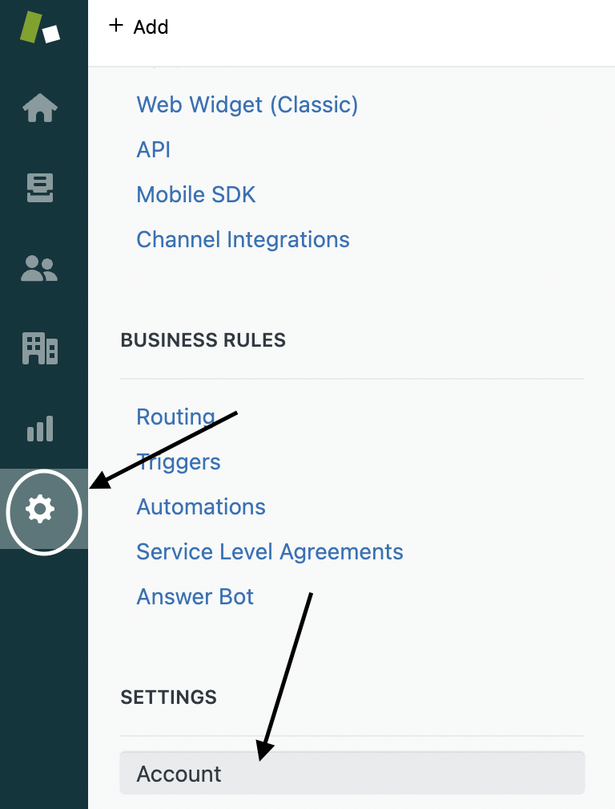
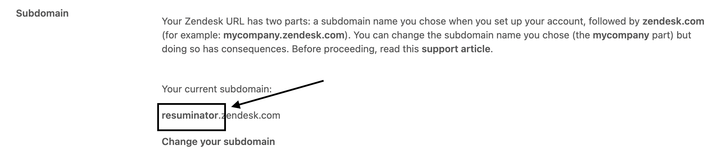
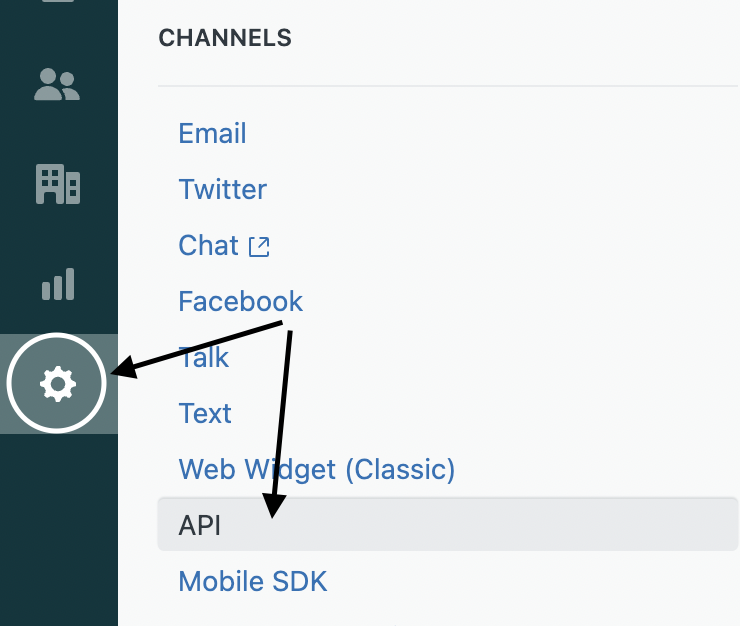
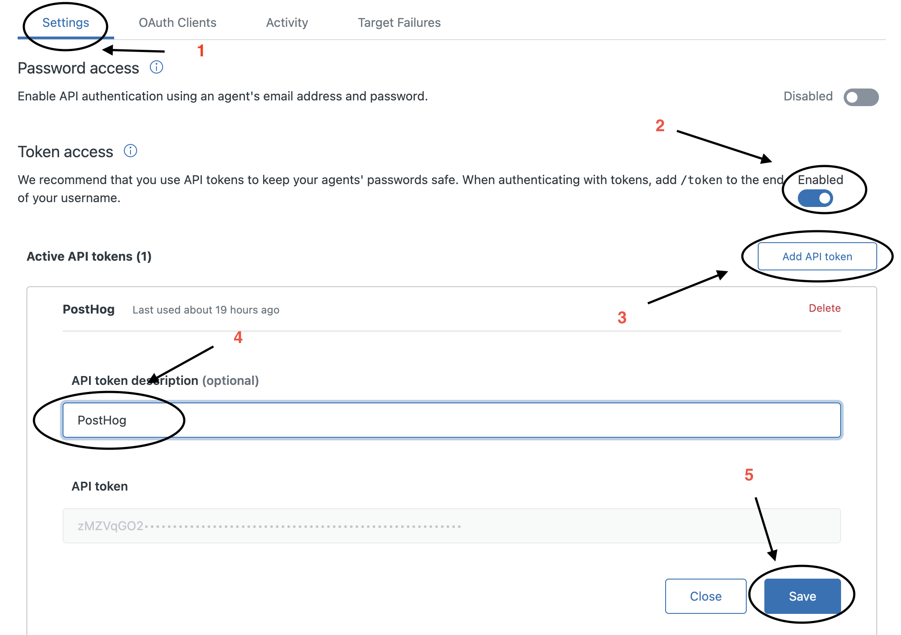
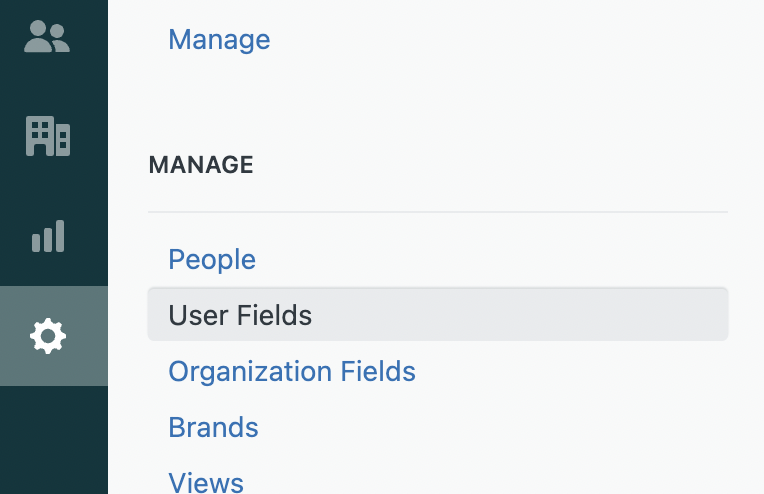
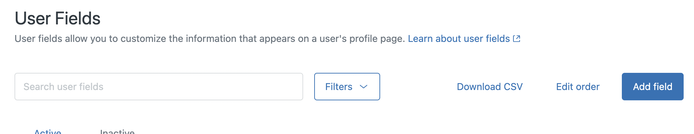
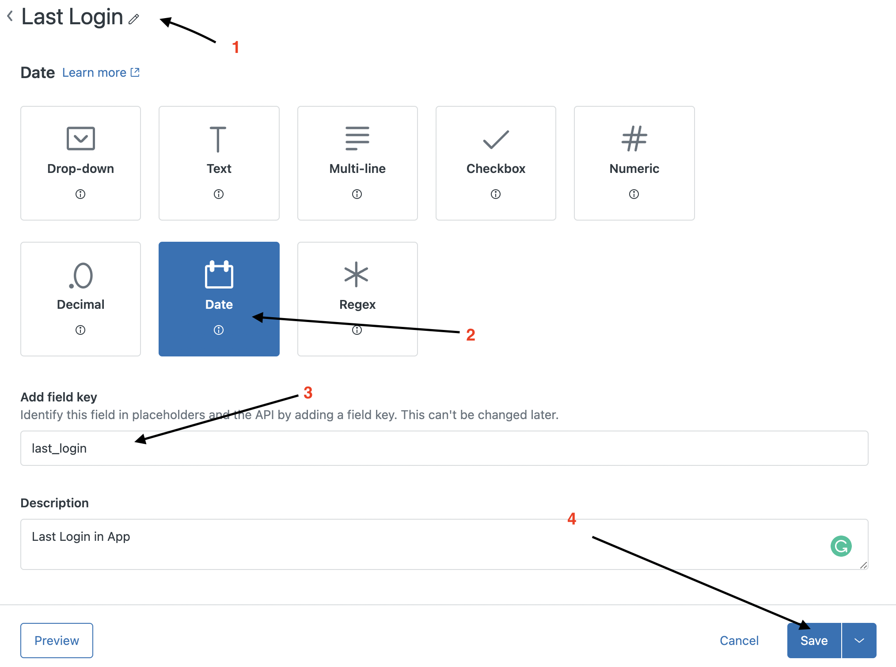

# PostHog Zendesk Plugin

## ZenDesk Account Details

Make sure to use Admin Account to perform below activities.

### Locate SubDomain

+ Head Over to Admin Section -> Settings -> Account. Refer Below

+ In Branding Section, Scroll Down to Subdomain and you can find your subdomain there. Refer Below.

### Get Authentication Token

+ Head Over to Admin Section -> Channels -> API. Refer Below

+ In Settings, Follow Below Steps:
  + Turn On Token Access.
  + Click on Add API Token.
  + Give it some name like PostHog.
  + Copy the Token(You won't be able to see it later).
  + Save the Token.
  + Refer Below
  
  

### Create Custom User Fields

+ Head Over to Admin Section -> Manage -> User Fields. Refer Below.

+ Click on Add Fields.

+ Follow Steps to create User Field.
  + Give Name
  + Select Type `Date`.
  + Add field key, (you will be required to share this key in PostHog while setting up)
  + Click Save, Refer Below.
    

## Plugin Features

+ Import new and historic ticket events to PostHog.
+ Only Date Type User Field is supported.
+ ZenDesk API have a limit of 400hits/min. If you have higher inflow than that, Please Contact Zendesk.
